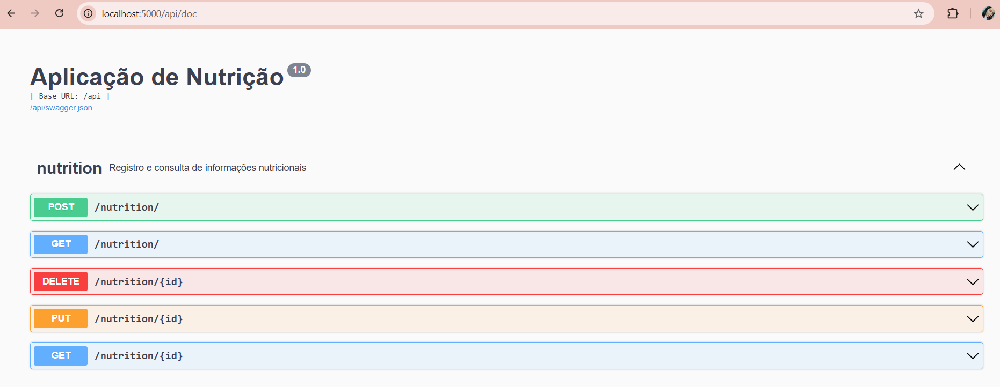

## Como executar

Será necessário ter todas as libs python listadas no `requirements.txt` instaladas. Após clonar o repositório, é necessário ir ao diretório raiz, pelo terminal, para poder executar os comandos descritos abaixo.

É fortemente indicado o uso de ambientes virtuais do tipo [virtualenv](https://virtualenv.pypa.io/).

```bash
(env)$ pip install -r requirements.txt
```
Este comando instala as dependências/bibliotecas, descritas no arquivo requirements.txt.

Para executar a API basta executar:
```bash
(env)$ flask run --host 0.0.0.0 --port 5000
```

Em modo de desenvolvimento é recomendado executar utilizando o parâmetro reload, que reiniciará o servidor automaticamente após uma mudança no código fonte.
```bash
(env)$ flask run --host 0.0.0.0 --port 5000 --reload
```
Abra o (http://localhost:5000/api/doc) no navegador para verificar o status da API em execução.

<p align="center">
  
</p>
