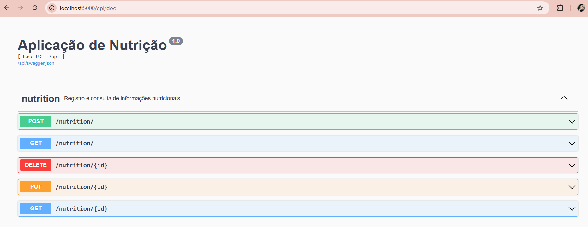

## Como executar

Será necessário ter todas as libs python listadas no `requirements.txt` instaladas. Após clonar o repositório, é necessário ir ao diretório raiz, pelo terminal, ativar o ambiente virtual env para poder executar os comandos descritos abaixo.

```bash
(env)$ pip install -r requirements.txt
```
Este comando instala as dependências/bibliotecas, descritas no arquivo requirements.txt.

Para executar a API basta executar:
```bash
(env)$ python app.py
```
Abra o (http://localhost:5000/api/doc) no navegador para verificar o status da API em execução.

<p align="center">
  
</p>

## 🛠️ Tecnologias Utilizadas

O back-end da aplicação foi construído com as seguintes tecnologias:

* **Python:** Linguagem de programação principal.
* **Flask:** Micro-framework web utilizado como base para a criação da API.
* **Flask-RESTX:** Extensão para Flask que facilita a criação de APIs RESTful, com validação de dados e geração automática de documentação Swagger UI.
* **SQLAlchemy:** ORM (Object-Relational Mapper) para interagir com o banco de dados de forma orientada a objetos.
* **Flask-Marshmallow:** Para serialização/desserialização de objetos, convertendo facilmente os dados do banco para o formato JSON e vice-versa.
* **Swagger UI:** Interface de documentação interativa gerada automaticamente pelo Flask-RESTX, permitindo visualizar e testar os endpoints da API diretamente no navegador.
